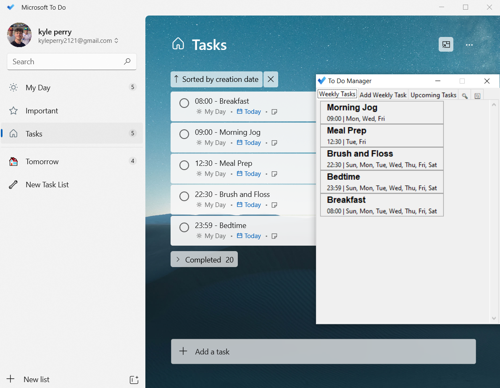
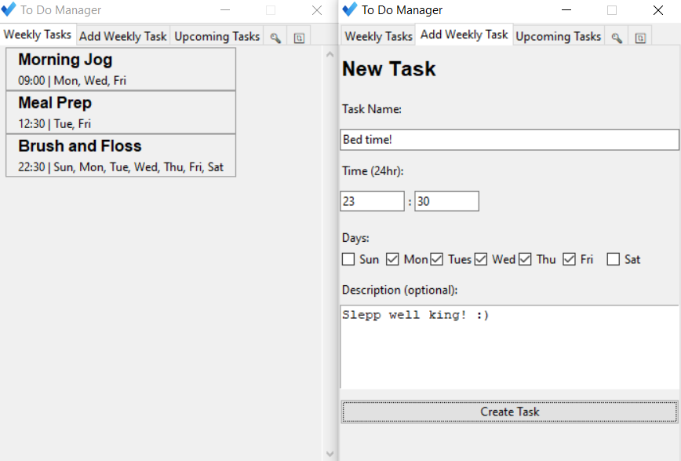
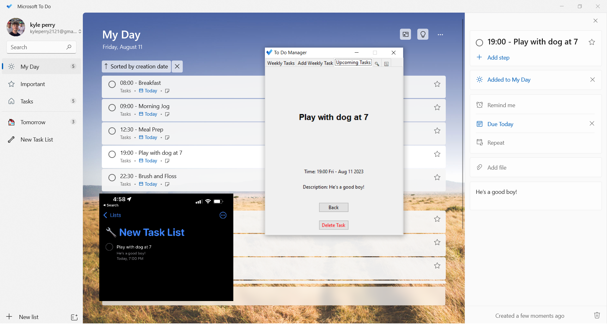
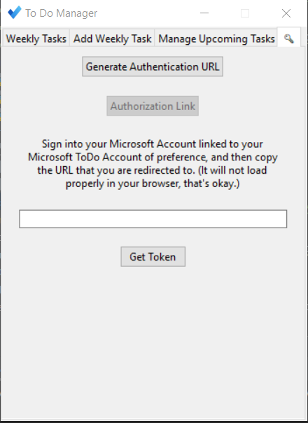

# ToDo GUI: Manage Your Weekly Tasks (Version 1.0) [Windows/iPhone]

[**Download Here**](https://drive.google.com/file/d/1GYv4MvPBQb1hPsTQugIuaOTx_NeQ2o_n/view?usp=sharing)

## Introduction
Welcome to ToDo Manager, a Microsoft ToDo manager which aims to organize your life by combining all of your deadlines into one application. The benefit of using Microsoft ToDo is that you can integrate this seamlessly with your Apple Reminders, access your tasks across multiple platforms, and enjoy a professional clean interface provided by microsoft. Unforutnately, Microsoft ToDo was created with the implication that only single-time tasks will be added to this application, and not used as a day-to-day task manager. Powered by Microsoft Graph's ToDo API, this evolving project aims to seamlessly connect your weekly tasks and Apple Reminders with Microsoft ToDo. 

## Table of Contents
- [Current Features](#current-features)
- [Planned Features](#planned-features)
- [Setup and Installation](#setup-and-installation)
- [Usage](#usage)
- [Limitations](#limitations)
- [Technologies Used](#technologies-used)
- [License](#license)
- [Acknowledgements](#acknowledgements)

## Current Features
- **Interactive GUI** - Manage all of your upcoming and weekly tasks from the "ToDoGUI" application. Here you can add your weekly schedule, and handle upcoming tasks from Microsoft ToDo.

- **Apple Reminders Integration** - Add tasks to your Microsoft ToDo within Reminders. ToDo will automatically integrate them into your schedule and will let you know through Microsoft ToDo when it is time to complete them.

- **Siri Compatabillity** - Setting tasks is as easy as saying "Hey Siri, remind me to do my homework at 5pm". Siri will automatically add this to your Apple Reminders, and ToDo will automatically add this to your schedule.
- **Easy Authentiation** - Authentication is as easy as clicking a button and signing in. ToDo will handle the rest of your Microsoft Authentication for you.

---

## Planned Features
- **Google Calendar Integration** - Add tasks to your Microsoft ToDo within Google Calendar. ToDo will automatically integrate them into your schedule and will let you know through Microsoft ToDo when it is time to complete them.
- **Single-Application Interface** - Instead of creating your own Azure App, my goal is to create a single application that can be used by anyone. This will require a lot of work, but I hope to make this a reality in the future.

## Setup and Installation
To set up and install this project, follow these steps:
1. Either [**Download Here**](https://drive.google.com/file/d/1GYv4MvPBQb1hPsTQugIuaOTx_NeQ2o_n/view?usp=sharing) (reccommended) or clone this repository to your local machine
2. Create a [Microsoft Account](https://account.microsoft.com) using a personal email of your choice
     - This will be the account that you will use to sign into the application
     - You can use an already existing email (gmail, hotmail, etc) or create a new one
3. Create a [Microsoft Azure Account](https://azure.microsoft.com/en-us/free/) using the same email as your Microsoft Account
4. Create a Microsoft Azure Application following these steps:
    - Select Azure Active Directory, App Registrations -> New Registration, and enter this information:
        - Name your application
        - Select "Accounts in any organizational directory (Any Azure AD directory - Multitenant) and personal Microsoft accounts (e.g. Skype, Xbox)"
        - Client Application
    - Under "Platform Configurations" click "Add a platform"
        - Select Web application and enter 'https://localhost/login/authorized' as the Redirect URI
    - Click Certificates and Secrets
        - Click "New Client Secret" and enter a description
        - Copy the client secret value and save it somewhere safe
5. Locate the .env file in the root directory of the project
    - Replace the values of the following variables with the values from your Azure Application
        - CLIENT_ID
        - CLIENT_SECRET
    - **Dont include any spaces between the '=' sign and the value**
    - **Ensure that there is a an extra line at the end of the file**

6. Sign into Microsoft ToDo with your Microsoft Account (Not your Azure account)

## Usage
Now that your Azure Application is conigured and your .env file is set up, you can run the application! To run the application, follow these steps:
1. Open "ToDoGUI.exe"
    - Feel free to create a shortcut to this file on your desktop
2. Navigate to the "Authenticate" tab and Follow the steps to gain a Token
    - You should only have to do this once! The token will be saved in your .env file
3. Navigate to the "Refresh Tasks" tab and click "Refresh Tasks"
    - This will add all of the existing tasks from the GUI into your Microsoft ToDo Applicaton along with the "Tomorrow" and "New Tasks" lists

That's it! You can now use the application to manage your weekly tasks. 

To incorporate your upcoming tasks, follow these steps:
1. Open your "Settings" app on your iOS device
2. Locate "Reminders"
3. Click "Accounts"
4. Click "Add Account"
5. Click "Outlook"
6. Add your Microsoft Account
7. Enable Reminders and Click "Save"

Now you should see your "New Tasks" list in Apple Reminders, along with the other lists from Microsoft ToDo.

To incoporate Siri, follow these steps:
1. Open your Settings app on your iOS device
2. Locate "Reminders"
3. Set Default List to "New Tasks"

To test it out, say:
> "Hey Siri, set a reminder for tonight at 6pm to do my homework"

This will automatically add the task to your "New Tasks" list in Apple Reminders, and ToDo will automatically add this to your schedule when you click "Refresh Token"

## Limitations
- **Automatic Refreshing** - Automatic Refreshing is not currently implemented. I did not want to set up a backend sever to manage individual refreshing, however I included the [ManageTasks.py](ManageTasks.py) file to allow you to refresh your tasks from the command line. I reccomend setting up a batchfile/cron job to run this file every night at midnight. This will allow your "New Tasks" list automatically added to your schedule along with your weekly tasks.
- **Adding tasks within Microsoft To Do** - Due to poor timing management on behalf of Microsoft's application, it is not reccomended that you add tasks within Microsoft ToDo. If you decide to, only add them to "New Tasks" if you want them to stay, and add a due date. If you do not include a due date, they will not be stored on your local machine and not accessible to the GUI.
- **Commas** - Because I use commas as a delimeter between task information, commas are not allowed in task names and descriptions. If you add reminders via iPhone, it will turn them into hypens instead.
- **Managing Upcoming Tasks** - Currently, managing upcoming tasks only allows you to delete them. I plan to incorporate a way to edit and create new ones within the GUI as well. As of now, the only way you can create them is through adding Tasks to your "New Tasks" list in Apple Reminders.
- **MacOS/Linux** - Because of PyInstaller (and my lack of access to other devices), this configuration is meant for Windows Users. Fortunately, all of my source code is in the "Master" branch and does not contain an executable. Feel free to run the python script within that branch if you are on a different operating system.

## Technologies Used
This was a Python Tkinter project utilizing the following technologies and libraries:
- [Python 3.9.1](https://www.python.org/downloads/release/python-391/)
- [Tkinter](https://docs.python.org/3/library/tkinter.html)
- [Microsoft Graph API](https://docs.microsoft.com/en-us/graph/api/resources/todo-overview?view=graph-rest-1.0)
- [PyInstaller](https://www.pyinstaller.org/)
- [Pymstodo](https://pypi.org/project/pymstodo/)
- [Requests](https://pypi.org/project/requests/)
- [Dotenv](https://pypi.org/project/python-dotenv/)

## License

This project is licensed under the MIT License - see the [LICENSE](LICENSE) file for details.

---

Stay tuned for updates, and feel free to explore the current state of the project. Your feedback and contributions are welcomed!
